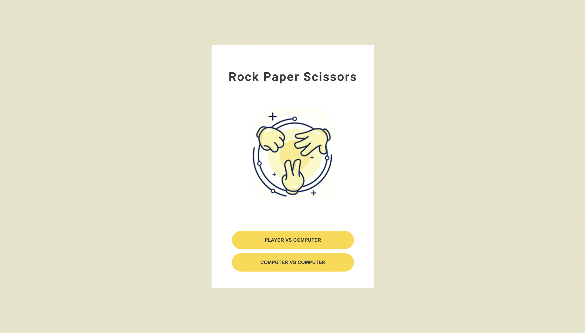
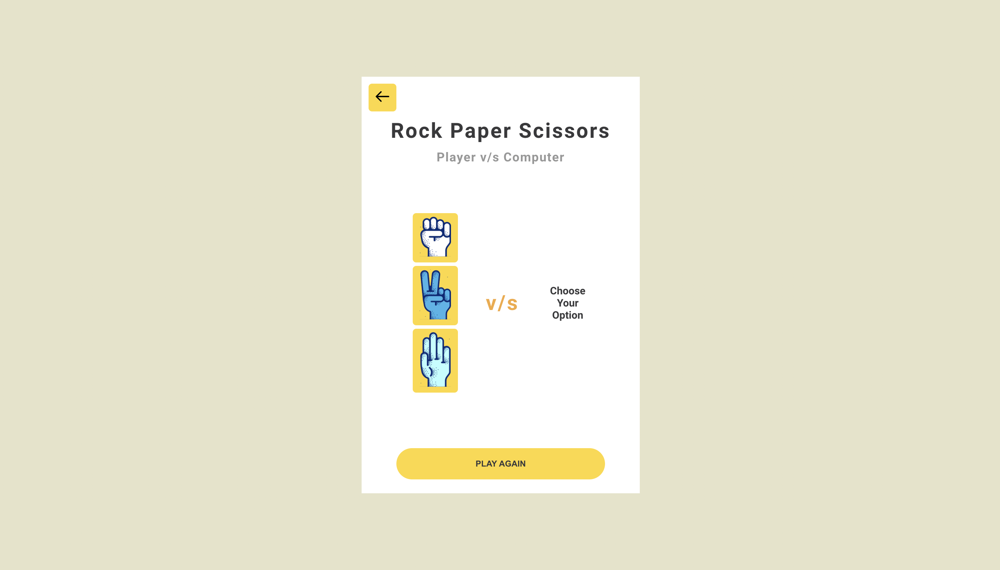
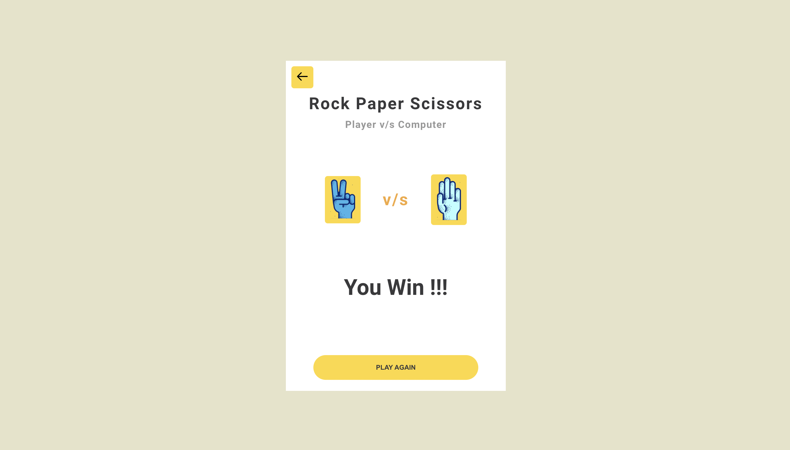
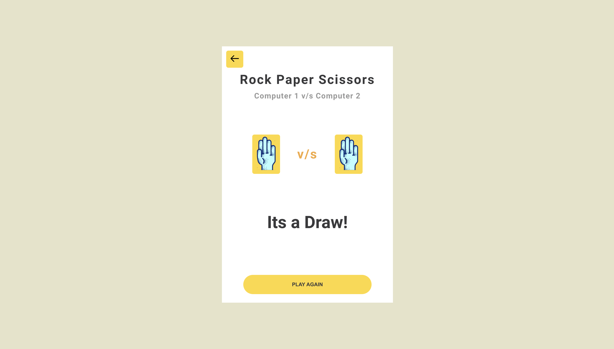
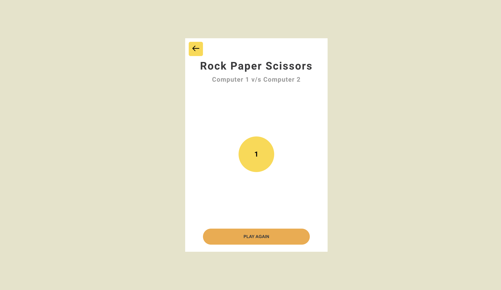

# React Rock Paper Scissors GUI App

Project is build using the create-react-app cli and being deployed over [Vercel](https://vercel.com/)

[Demo - GUI Game](https://react-rock-paper-scissors-eight.vercel.app/) is also available

## Project Game App Build Instructions

Make sure you've [`git`](https://git-scm.com/book/en/v2/Getting-Started-Installing-Git), [`yarn`](https://classic.yarnpkg.com/lang/en/docs/install/#mac-stable) & [`nodejs`](https://nodejs.org/en/) installed in your system.

Open terminal and follow these steps;

- Step 1: Clone the repo.

```bash
git clone https://github.com/ekas/react-rock-paper-scissors
```

You should now see a `react-rock-paper-scissors` folder in your present working directory. Let's change directory to it.

```bash
cd react-rock-paper-scissors/
cd GameGUIApp
```

- Step 2: Frontend Build Instructions. Install dependencies.

```bash
yarn install
```

This will use `yarn` to install project dependencies.

- Step 3: Start the frontend project.

```bash
yarn start
```

This will run a local instance of the application `http://localhost:3000/`

## Project test Instructions

- Step 1: Use following command to run Test cases

```bash
yarn run test
```

## Project Extension

- If you would like to add more Game Objects.
- Simply open `src/gameEngine.ts` file you wil find a `GameRules`. Add JSON as follows:

```js
{
    name: "pencil",
    image: "pencil.png",
    rules: {
      pencil: undefined, //default case when opponet choose the same Object
      paper: true
      scissors: false,
      rock: true,
    },
},
```

```text
Note: Do not forget to add pencil.png in `public/images` folder. Furthermore, Add rule for pencil in other json Objects

- `true` if other object beats pencil
- `false` if other object does notbeats pencil

```

- Also, add object name `pencil` in `GameObjectsType` in file `src/types/Game.ts`.

## Project Features

- Simple Rock Paper Scissors Game app.
- Choose mode between Player vs Computer or Computer vs Computer.
- For Player vs Computer, user will jump to game screen and then chose a option. After, that a loader for 3 seconds will appear and once the loader finish results will be displayed.
- For Player vs Computer, user will jump to game screen. After, that a loader for 5 seconds will appear and once the loader finish random selection will be done for both players and results will be displayed.

## Project Screenshots











## Thank You
